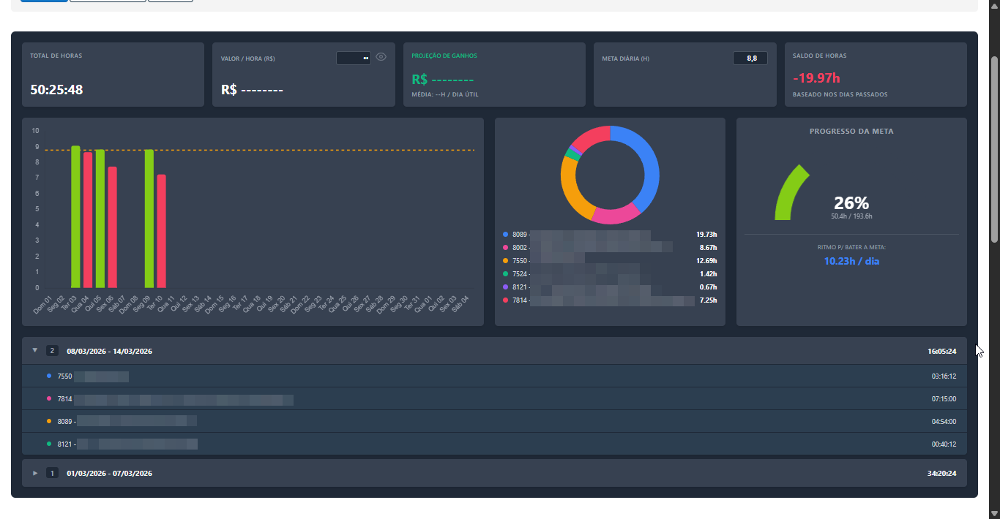

# PSOffice Analytics Dashboard

## Descricao
Uma extensao para Google Chrome que atua como uma camada visual sobre o sistema PSOffice. Ela transforma a pagina padrao de relatorio de apontamento de horas em um dashboard analitico moderno e interativo, com design inspirado em ferramentas globais de rastreamento de tempo.

A extensao extrai, estrutura e agrupa os dados da tabela original do sistema localmente, sem enviar dados para servidores externos, garantindo privacidade e agilidade.

## Capturas de Tela

*Legenda: Visao geral do dashboard analitico.*

## Funcionalidades Principais

* **Calculo de Totais e Saldo:** Totaliza horas trabalhadas no periodo filtrado e calcula o saldo acumulado (positivo ou negativo) baseado nos dias uteis passados.
* **Projecao Financeira:** Permite a insercao de um valor por hora e calcula o faturamento projetado para o periodo. O valor e ocultavel para manter a privacidade do usuario em ambientes de escritorio.
* **Gestao de Metas:** Definicao de meta de horas por dia. O sistema calcula automaticamente o "Ritmo para Bater a Meta", informando quantas horas por dia util o usuario precisa fazer para alcancar o objetivo no periodo filtrado.
* **Visualizacao Grafica (Chart.js):**
    * **Grafico de Barras Misto:** Exibe as horas trabalhadas por dia em contraste com uma linha de demarcacao da meta estabelecida. Cor verde demonstra que a meta diária foi atingida, cor vermelha indica o contrário.
    * **Grafico de Rosca (Projetos):** Demonstra a distribuicao percentual e quantitativa do tempo investido em cada projeto.
    * **Velocimetro de Progresso:** Um grafico em formato de semi-circulo indicando o percentual de conclusao da meta total de horas.
* **Agrupamento Semanal:** Lista expansivel (acordeao) que agrupa automaticamente os registros de tempo em blocos semanais (Domingo a Sabado).
* **Privacidade Integrada:** As configuracoes de meta e valor por hora sao salvas exclusivamente no `localStorage` do navegador do usuario.

## Como Instalar (Modo Desenvolvedor)

Como esta extensao e de uso especifico, a instalacao pode ser feita manualmente carregando os arquivos diretamente no navegador:

1. Faca o download do codigo-fonte deste repositorio ou clone-o usando o Git:
   `git clone https://github.com/gracielerodrigues-dev/psoffice-analytics-extension.git`
2. Abra o Google Chrome e navegue ate a pagina de extensoes digitando `chrome://extensions/` na barra de enderecos.
3. No canto superior direito da pagina, ative a chave "Modo do desenvolvedor".
4. Clique no botao "Carregar sem compactacao" que aparecera no canto superior esquerdo.
5. Selecione a pasta raiz da extensao que voce baixou (onde esta o arquivo `manifest.json`).
6. A extensao sera instalada e ativada automaticamente.

## Como Usar

1. Apos instalar a extensao, acesse o sistema PSOffice.
2. Navegue ate a secao de relatorios "Meu Resumo de Horas".
3. Filtre o periodo desejado.
4. O dashboard sera renderizado automaticamente no topo da pagina, antes da tabela padrao de registros.
5. Utilize os campos de "Valor / Hora" e "Meta Diaria" para personalizar seus indicadores.

## Estrutura do Projeto

* `manifest.json`: Arquivo de configuracao e permissoes da extensao para o Chrome.
* `css/dashboard.css`: Estilizacao completa da interface, utilizando variaveis de um tema Dark moderno.
* `js/content.js`: Script principal de orquestracao. Controla o carregamento, escuta eventos e renderiza os graficos.
* `js/dashboard.js`: Responsavel por criar a estrutura HTML e injeta-la no DOM da pagina do PSOffice.
* `js/parser.js`: Motor de extracao de dados. Le a tabela original em HTML, lida com celulas mescladas e retorna um array de objetos estruturados.
* `js/utils.js`: Funcoes utilitarias auxiliares para conversao de horas, formatacao de datas e calculo de dias uteis.

## Tecnologias Utilizadas

* JavaScript (ES6+)
* HTML5 & CSS3
* Chart.js (Renderizacao de graficos)
* Chrome Extensions API (Manifest V3)